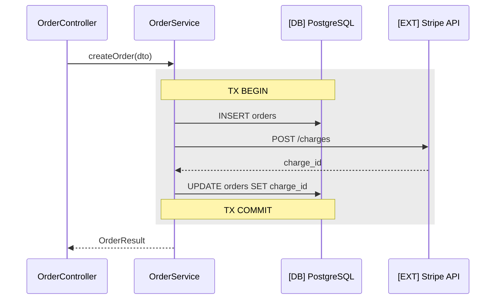

# Mermaid 記法の使い分けと検証基準

sequence-diagram-generator が図を生成するときの判断基準。図の生成前に読む。
新しい強調パターンや構文の落とし穴を見つけたら、このファイルに追記して育てる。

## 1. sequenceDiagram / flowchart の使い分け

既定は `sequenceDiagram`。次の条件に当てはまるときだけ `flowchart` を選び、
選んだ理由を出力に 1 行添える。

| 図の主役 | 選ぶ記法 | 判断の目安 |
|---|---|---|
| 参加者間のやり取り（リクエスト→応答、レイヤ間の呼び出し、外部システムとの通信） | `sequenceDiagram` | 「誰が誰を呼ぶか」を聞かれている |
| 条件分岐・状態遷移そのもの（バリデーションの分岐網、リトライ/フォールバックの判断木） | `flowchart TD` | `alt` ブロックが 4 つ以上入れ子になり、参加者が 2〜3 に対して分岐が主役になっている |

sequenceDiagram で `alt` の入れ子が深くなって読めなくなったら、
全体は sequenceDiagram のまま、分岐部分だけを flowchart の別図に切り出す手もある。

## 2. 参加者 (participant) の立て方

- 粒度は層・コンポーネント・外部システム単位。関数ごとに participant を立てない。
- 命名はコード上の識別子（クラス名・パッケージ名・サービス名）を英語のまま使う。
  例: `participant OrderService`。和訳して原文と突き合わせられなくしない。
- 並び順は呼び出しの流れ順（左が起点、右へ行くほど深い層・外部）。
- 外部システムは内部コンポーネントと区別できる名前にする（例: `MySQL`, `Stripe API`, `SQS`）。

## 3. 外部 I/O の強調記法

DB クエリ・外部 API・キュー・キャッシュへの矢印は、内部呼び出しと見分けが付くようにする。
以下を組み合わせて使う。

- 参加者名の前に絵柄ではなく分類を付ける: `participant DB as [DB] PostgreSQL`、
  `participant Stripe as [EXT] Stripe API`、`participant Queue as [MQ] SQS`、
  `participant Cache as [CACHE] Redis`。
- 外部 I/O への矢印は非同期でも実線 `->>` を使い、メッセージに操作の種類を書く。
  例: `OrderService->>DB: SELECT orders (findByUserId)`。
- トランザクション境界は `rect` ブロックで囲み、`Note over` で `BEGIN` / `COMMIT` を示す。



## 4. `(要確認)` 注釈

- 静的に追えなかった経路（動的ディスパッチ・DI・リフレクション・イベント購読）は、
  矢印のメッセージ末尾に `(要確認)` を付ける。
  例: `S->>Handler: dispatch(event) (要確認)`。
- `(要確認)` の矢印には、補足の箇条書きに「何を見れば確定するか」を必ず 1 行対応させる。

## 5. 構文チェックリスト（mmdc が使えない場合の目視検証）

Mermaid はメッセージ中の一部文字でパースが壊れる。渡す前に確認する。

- [ ] 先頭行が `sequenceDiagram` / `flowchart TD` になっている（typo・全角スペースなし）
- [ ] participant の alias 宣言（`participant X as ...`）が使用箇所より前にある
- [ ] メッセージ中に `;` `:` を素で使っていない（`:` はメッセージ区切りと衝突する。
      `#58;` に置換するか言い換える）
- [ ] メッセージ中の `()` は可、`{}` `<>` は flowchart のノード形状と衝突しやすいので避ける
      （ジェネリクスは `List~T~` 風に書くか省略する）
- [ ] `alt` / `opt` / `loop` / `rect` に対応する `end` が同数ある
- [ ] `activate` / `deactivate` を使った場合、対応が取れている（使わないのが無難）
- [ ] flowchart のノード ID に日本語・ハイフン始まりを使っていない
      （ID は英数字、表示名は `id["日本語ラベル"]` 側に書く）
- [ ] 行頭コメントは `%%`（`//` や `#` は不可）

`mmdc` が使える場合はパースで検証する:

```bash
npx -y @mermaid-js/mermaid-cli -i diagram.mmd -o /dev/null
```
